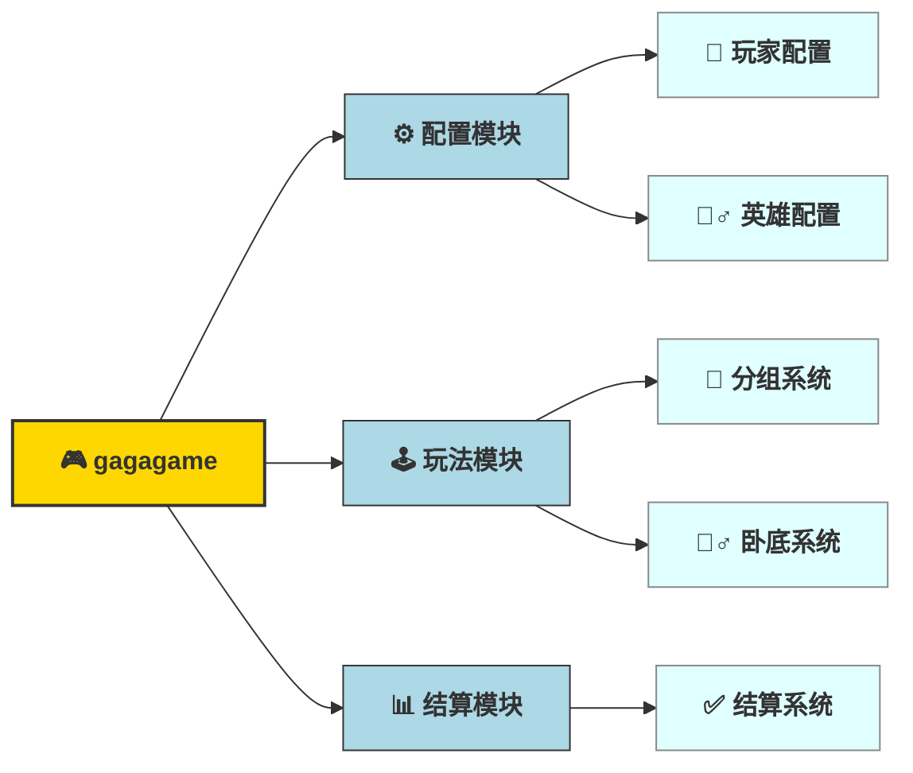

## 主要功能



## 安装和运行
### 环境要求
- Go 1.20 或更高版本
### 安装步骤
1. 克隆项目
    ```bash
     git clone <repository-url>
    ```
2. 安装依赖
    ```bash
    go mod tidy
    ```
3. 运行项目
    ```bash
    go run main.go
    ```
4. 访问应用
浏览器访问 `http://服务器IP:8008/gagaFamily/game`
