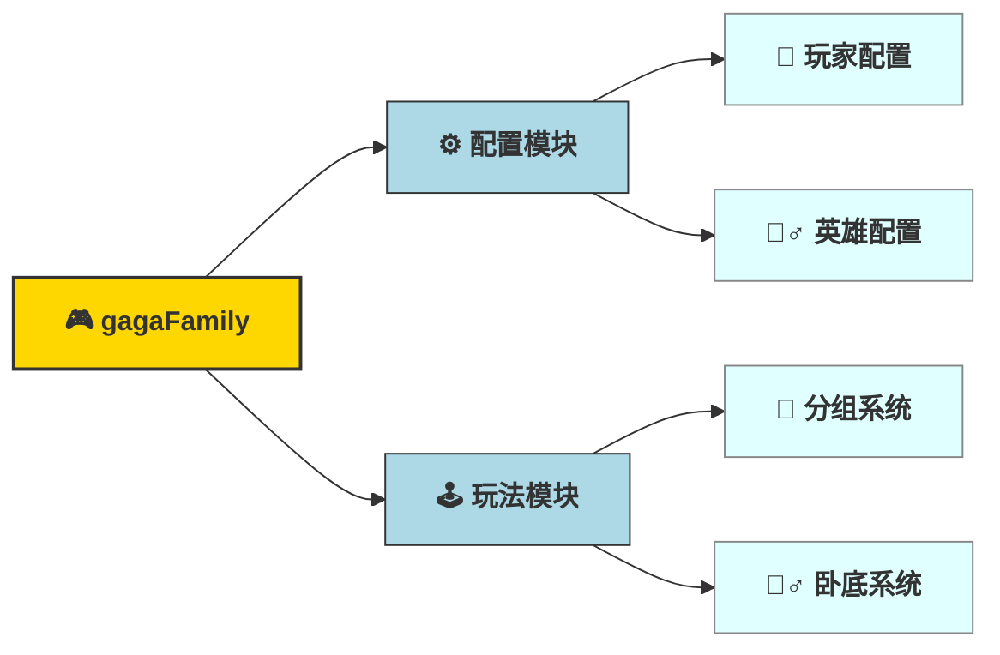

# gagaFamily
版权所有 (c) 2025, 嘎嘎群集体成员保留所有权利。
版权所有 (c) 2025, gaga.org保留所有权利。

嘎嘎群始于2023年，由以下成员组成：柯镇恶、方、47、逍遥、全姐、闪闪、小何、季、真心、letuplay。以上成员保留所有著作权（包括但不限于文字、图片、
音频、视频、图表、界面设计、版面框架、有关数据或电子文档等）均受中华人民共和国法律法规和相应的国际条约保护，嘎嘎群成员 享有上述知
识产权，但相关权利人依照法律规定应享有的权利除外。未免疑义，本条所指的"知识产权"是指任何及所有基于本软件产生的：（a）版权商标、
商号、域名、与商标和商号相关的商誉、设计和专利；与创新、技术诀窍、商业秘密、保密技术、非技术信息相关的权利；（b）人身权、掩模
作品权、署名权和发表权；以及（c）在本协议生效之前已存在或此后出现在世界任何地方的其他工业产权、专有权、与"知识产权"相关的权利，
以及上述权利的所有续期和延长，无论此类权利是否已在相关法域内的相关机构注册。

Copyright (c) 2025, gaga  All rights reserved.
Copyright (c) 2025, gaga.org  All rights reserved.

## 项目简介

gagaFamily 是一个轻量级的 Web 游戏服务器，支持多人分组和卧底游戏玩法。项目采用 Go 语言开发，前端为纯 HTML+CSS+JS，**已全面适配移动端，界面美观，交互友好**。

## 主要功能



### 功能详述

- **配置模块**: 管理游戏基础配置
  - **玩家配置**: 管理玩家信息、禁用英雄列表、权重英雄列表
  - **英雄配置**: 管理各位置英雄池配置

- **玩法模块**: 核心游戏功能
  - **分组系统**: 10人自动分组，随机分配游戏位置和英雄
  - **卧底系统**: 多人卧底游戏，随机指定卧底角色

## 使用方式

1. 启动后端 Go 服务（见下方安装与运行）
2. 浏览器访问 `http://服务器IP:8008/gagaFamily/game`


## 安装和运行

### 环境要求
- Go 1.20 或更高版本

### 安装步骤

1. 克隆项目
```bash
git clone <repository-url>
cd gagaFamily
```

2. 安装依赖
```bash
go mod tidy
```

3. 运行项目
```bash
go run main.go
```

4. 访问应用
浏览器访问 `http://服务器IP:8008/gagaFamily/game`
